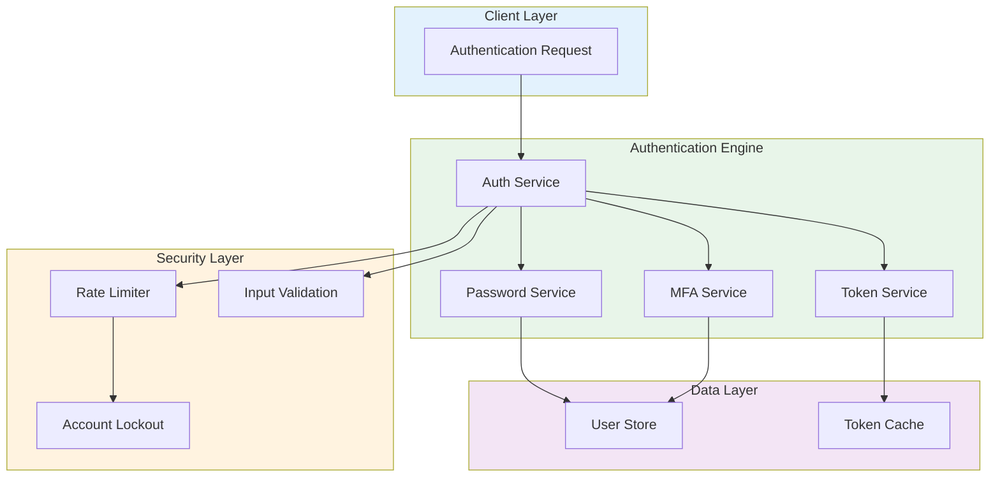
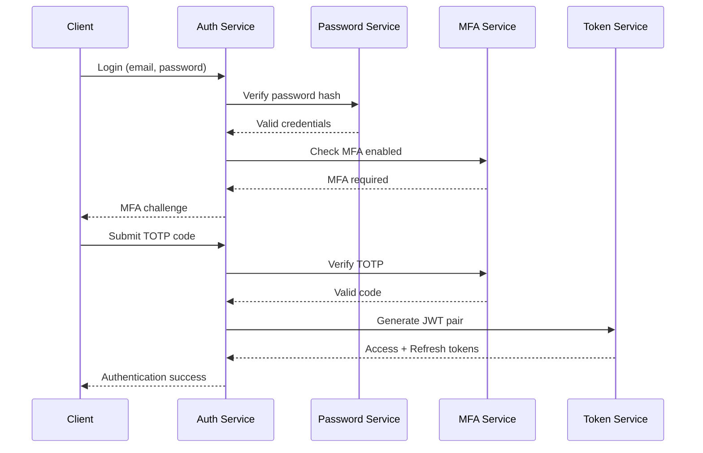

# Advanced Authentication System


[English](#english) | [Portugues (BR)](#portugues-br)

---

## English

### Overview

Enterprise-grade authentication system built with TypeScript, featuring JWT token management, multi-factor authentication (TOTP-based MFA), role-based access control (RBAC), and configurable security policies. Designed for production environments requiring robust identity management, rate limiting, and account lockout protection.

### Architecture



### Authentication Flow



### Key Features

- **JWT Token Management** -- Access and refresh token pairs with configurable expiration and automatic rotation
- **Multi-Factor Authentication** -- TOTP-based MFA with QR code provisioning and backup codes
- **Role-Based Access Control** -- Granular RBAC with hierarchical role inheritance
- **Password Security** -- Bcrypt hashing with configurable salt rounds and complexity policies
- **Rate Limiting** -- Sliding window rate limiter to prevent brute-force attacks
- **Account Lockout** -- Automatic lockout after configurable failed attempt thresholds
- **Input Validation** -- Schema-based validation for all authentication endpoints
- **Audit Trail** -- Comprehensive logging of authentication events

### Industry Application

This system addresses core identity management challenges in enterprise applications, fintech platforms, and SaaS products. The modular architecture supports integration with existing microservices, API gateways, and OAuth providers, making it suitable for banking applications, healthcare portals, and multi-tenant platforms requiring SOC2-compliant authentication workflows.

### Tech Stack

| Technology | Purpose |
|------------|---------|
| **TypeScript 5.0+** | Type-safe application logic |
| **Node.js 20+** | Runtime environment |
| **bcryptjs** | Password hashing |
| **jsonwebtoken** | JWT token generation and verification |
| **Jest** | Unit and integration testing |
| **Docker** | Containerized deployment |

### Quick Start

```bash
# Clone the repository
git clone https://github.com/galafis/Advanced-Authentication-System-TS.git
cd Advanced-Authentication-System-TS

# Install dependencies
npm install

# Configure environment
cp .env.example .env

# Development mode
npm run dev

# Production build
npm run build
npm start
```

### Docker

```bash
# Build the image
docker build -t advanced-auth-system .

# Run the container
docker run -p 3000:3000 --env-file .env advanced-auth-system
```

### Project Structure

```
Advanced-Authentication-System-TS/
├── src/
│   ├── services/
│   │   ├── __tests__/
│   │   ├── auth.service.ts
│   │   ├── mfa.service.ts
│   │   ├── password.service.ts
│   │   ├── token.service.ts
│   │   └── user.store.ts
│   ├── utils/
│   │   ├── __tests__/
│   │   ├── rate-limiter.ts
│   │   └── validation.ts
│   ├── config.ts
│   ├── errors.ts
│   ├── index.ts
│   └── types.ts
├── main.ts
├── Dockerfile
├── jest.config.ts
├── package.json
├── tsconfig.json
└── LICENSE
```

### Testing

```bash
# Run all tests
npm test

# Run with coverage
npm run test -- --coverage

# Watch mode
npm run test:watch
```

### License

This project is licensed under the MIT License - see the [LICENSE](LICENSE) file for details.

### Author

**Gabriel Demetrios Lafis**
- GitHub: [@galafis](https://github.com/galafis)
- LinkedIn: [Gabriel Demetrios Lafis](https://linkedin.com/in/gabriel-demetrios-lafis)

---

## Portugues (BR)

### Visao Geral

Sistema de autenticacao de nivel empresarial construido com TypeScript, apresentando gerenciamento de tokens JWT, autenticacao multi-fator (MFA baseada em TOTP), controle de acesso baseado em funcoes (RBAC) e politicas de seguranca configuraveis. Projetado para ambientes de producao que exigem gerenciamento robusto de identidade, limitacao de taxa e protecao contra bloqueio de conta.

### Principais Funcionalidades

- **Gerenciamento de Tokens JWT** -- Pares de tokens de acesso e atualizacao com expiracao configuravel e rotacao automatica
- **Autenticacao Multi-Fator** -- MFA baseada em TOTP com provisionamento de QR code e codigos de backup
- **Controle de Acesso Baseado em Funcoes** -- RBAC granular com heranca hierarquica de funcoes
- **Seguranca de Senha** -- Hashing bcrypt com salt rounds configuraveis e politicas de complexidade
- **Limitacao de Taxa** -- Limitador de taxa por janela deslizante para prevenir ataques de forca bruta
- **Bloqueio de Conta** -- Bloqueio automatico apos limites configuraveis de tentativas falhas
- **Validacao de Entrada** -- Validacao baseada em schema para todos os endpoints de autenticacao
- **Trilha de Auditoria** -- Registro abrangente de eventos de autenticacao

### Aplicacao na Industria

Este sistema aborda desafios centrais de gerenciamento de identidade em aplicacoes empresariais, plataformas fintech e produtos SaaS. A arquitetura modular suporta integracao com microservicos existentes, API gateways e provedores OAuth, tornando-o adequado para aplicacoes bancarias, portais de saude e plataformas multi-tenant que requerem fluxos de autenticacao em conformidade com SOC2.

### Stack Tecnologica

| Tecnologia | Finalidade |
|------------|-----------|
| **TypeScript 5.0+** | Logica de aplicacao type-safe |
| **Node.js 20+** | Ambiente de execucao |
| **bcryptjs** | Hashing de senhas |
| **jsonwebtoken** | Geracao e verificacao de tokens JWT |
| **Jest** | Testes unitarios e de integracao |
| **Docker** | Deploy containerizado |

### Inicio Rapido

```bash
# Clonar o repositorio
git clone https://github.com/galafis/Advanced-Authentication-System-TS.git
cd Advanced-Authentication-System-TS

# Instalar dependencias
npm install

# Configurar ambiente
cp .env.example .env

# Modo de desenvolvimento
npm run dev

# Build de producao
npm run build
npm start
```

### Docker

```bash
# Construir a imagem
docker build -t advanced-auth-system .

# Executar o container
docker run -p 3000:3000 --env-file .env advanced-auth-system
```

### Testes

```bash
# Executar todos os testes
npm test

# Executar com cobertura
npm run test -- --coverage
```

### Licenca

Este projeto esta licenciado sob a Licenca MIT - veja o arquivo [LICENSE](LICENSE) para detalhes.

### Autor

**Gabriel Demetrios Lafis**
- GitHub: [@galafis](https://github.com/galafis)
- LinkedIn: [Gabriel Demetrios Lafis](https://linkedin.com/in/gabriel-demetrios-lafis)
